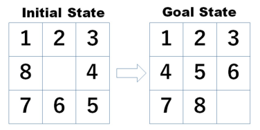
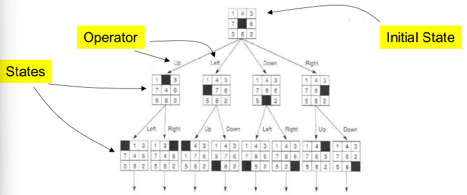
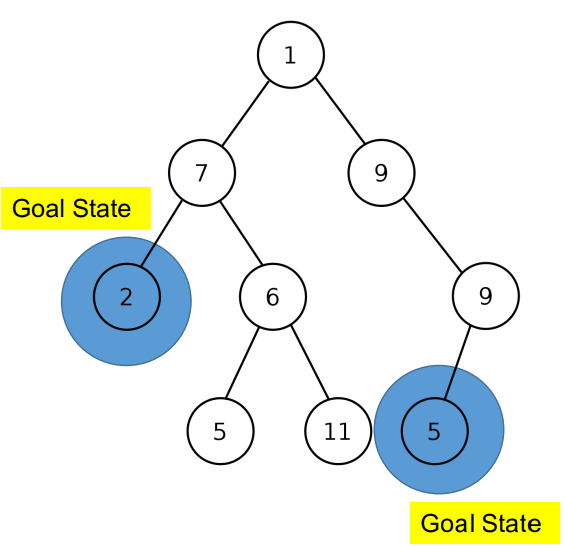
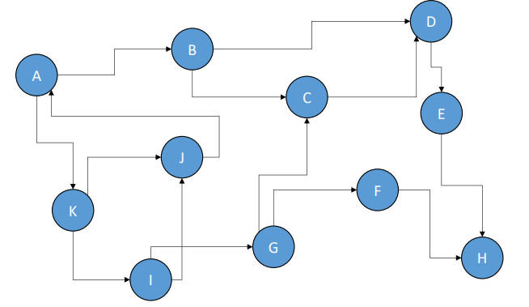
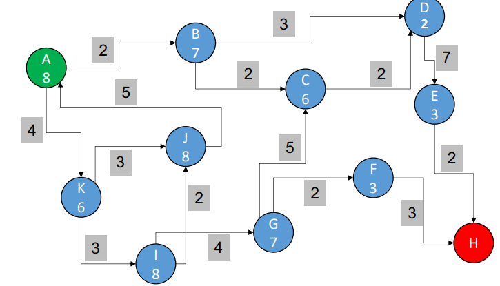

# Parte 1: Pesquisa em Espaço de Estados

## Tipos de agentes de I.A.

Existem duas perpetivas amplamente aceitas sobre sendo um agente de I.A.:

- Artificial Narrow Intelligence (ANI): São agentes conseguem executar uma só tarefa
  de modo inteligente e melhor que um ser humano, porém são inuteís em outras tarefas (Weak AI).


- Artificial General Intelligence (AGI): São agentes que conseguem executar multiplas
  tarefas melhor que um ser humano (Strong AI).

## Representação de estados

### Definição de estado

Um **estado** é uma representa toda a informação relativa á **posição atual do agente no ambiente** (espaço de estados)
numa estrutura de dados. Alguns estados podem ser denominados **solução** ou **objetivo**, pois representam uma situação
que o agente deseja alcançar.


*Fig.1 — Exemplo de um espaço de estados*

### Representação de estados (Exercicios)

Neste exemplo temos um ‘_puzzle_’ de 8 peças representado numa matriz 3x3 (9 quadrados). Um dos quadrados está vazio e
as outras 8 peças estão dispostas aleatoriamente. O objetivo é mover as peças para que elas fiquem na ordem correta,
como mostrado na figura 2.



*Fig.2 — Exemplo de estado inicial/Estado Objetivo*

1. Define um modo apropriado de representar um estado do ‘_puzzle_’ no Python.
2. Cria uma função em python que recebe um estado e retorna os seus sucessores.
3. Cria uma função em python que recebe um estado e uma profundidade e retorna uma árvore de estados.
4. Cria uma função em python que recebe um estado inicial e percorre a sua árvore de estados e retorna a profundidade da
   melhor solução usando BFS.

```python
estado = [1, 2, 3, 4, 5, 6, 7, 8, 0]
```

```python
def sucessores(estado):
    sucessores = []
    # Encontrar o índice do espaço vazio
    pos_zero = estado.index(0)
    # Converter a posição para 2D
    pos_zero_2d = (pos_zero // 3, pos_zero % 3)
    
    if pos_zero_2d[0] > 0:
        # Mover para cima
        novo_estado = estado.copy()
        novo_estado[pos_zero] = novo_estado[pos_zero - 3]
        novo_estado[pos_zero - 3] = 0
        sucessores.append(novo_estado)
    if pos_zero_2d[0] < 2:
        # Mover para baixo
        novo_estado = estado.copy()
        novo_estado[pos_zero] = novo_estado[pos_zero + 3]
        novo_estado[pos_zero + 3] = 0
        sucessores.append(novo_estado)
    if pos_zero_2d[1] > 0:
        # Mover para esquerda
        novo_estado = estado.copy()
        novo_estado[pos_zero] = novo_estado[pos_zero - 1]
        novo_estado[pos_zero - 1] = 0
        sucessores.append(novo_estado)
    if pos_zero_2d[1] < 2:
        # Mover para direita
        novo_estado = estado.copy()
        novo_estado[pos_zero] = novo_estado[pos_zero + 1]
        novo_estado[pos_zero + 1] = 0
        sucessores.append(novo_estado)
    return sucessores
```

```python
# Representação da árvore de estados: arvore = [estado, profundidade, [filhos]]
def arvore_estados(estado, profundidade):
    arvore = [estado, profundidade, []]
    if profundidade > 0:
        for filho in sucessores(estado):
            arvore[2].append(arvore_estados(filho, profundidade - 1))
    return arvore
```

```python
def bfs(estado_inicial):
    # Representação da fila: fila = [[estado, profundidade]]
    fila = [[estado_inicial, 0]]
    while fila:
        estado, profundidade = fila.pop(0)
        if estado == estado_objetivo:
            return profundidade
        for filho in sucessores(estado):
            fila.append([filho, profundidade + 1])
    return -1
```

# Parte 2: Pesquisa em Espaço de Estados

## Problemas de Pesquisa em Espaço de Estados

Formalmente são baseados em duas partes:

- Num **estado** que contém a informação necessária para prever qual efeito terá uma ação para determinar um certo
  objetivo.
- Num conjunto de **operadores** que definem o quão válido é a passagem de um estado para outro.



### Exemplo: O problema dos jarros de água

Temos 2 jarros de capacidade 4 e 3 litros respetivamente. O objetivo é encher o jarro de 4 litros com água com
exatamente 2 litros. O estado inicial é ambos os jarros vazios.

Passo-a-passo:

- Definir a estrutura de dados para representar um estado

```
estado = (X, Y) onde X e Y são as quantidades de água no jarro de 4 e 3 litros respetivamente.
```

- Definir os operadores

```
- encher_jarro_4: (X, Y) -> (4, Y)
- encher_jarro_3: (X, Y) -> (X, 3)
- esvaziar_jarro_4: (X, Y) -> (0, Y)
- esvaziar_jarro_3: (X, Y) -> (X, 0)
- transferir_jarro_4_para_3: (X, Y) -> (X + d, Y - d)
- transferir_jarro_3_para_4: (X, Y) -> (X - d, Y + d)
```


*Fig.2 Exemplo de uma possivel solução*

### Exercício

Escreve um programa que resolva o problema dos jarros de água (em Python).

```python
def encher_jarro_4(estado):
    return (4, estado[1])
def encher_jarro_3(estado):
    return (estado[0], 3)
def esvaziar_jarro_4(estado):
    return (0, estado[1])
def esvaziar_jarro_3(estado):
    return (estado[0], 0)
def transferir_jarro_4_para_3(estado):
    d = min(estado[0], 3 - estado[1])
    return (estado[0] - d, estado[1] + d)
def transferir_jarro_3_para_4(estado):
    d = min(estado[1], 4 - estado[0])
    return (estado[0] + d, estado[1] - d)
def sucessores(estado):
    return [encher_jarro_4(estado), encher_jarro_3(estado), esvaziar_jarro_4(estado), esvaziar_jarro_3(estado), transferir_jarro_4_para_3(estado), transferir_jarro_3_para_4(estado)]
def bfs(estado_inicial, objetivo):
    visitados = set()
    fila = [estado_inicial]
    while fila:
        estado = fila.pop(0)
        if estado == objetivo:
            return True
        visitados.add(estado)
        for s in sucessores(estado):
            if s not in visitados:
                fila.append(s)
    return False
print(bfs((0, 0), (2, 0)))
```

## Solução Ótima em problemas de Pesquisa em Espaço de Estados

No exemplo anterior o objetivo era **exclusivamente** encontrar uma solução. No entanto, não foi considerado o **custo**
das operações feitas para atingir o objetivo. Por vezes podemos atingir uma solução de maneiras diferentes e até mesmo
com um **número menor de operações**.


Existem diversas estrátegias de pesquisa num espaço de estados, que estão normalmente divididas em 2 famílias:

- **Não informadas**: não utilizam nenhuma informação adicional sobre o problema.


- **Informadas**: utilizam informação adicional sobre o problema.

## Pesquisa Não Informada

Dentro desta categoria existem duas estratégias principais:

- **Breadth-First Search (BFS)**: explora os nós da árvore de estados em largura (último nó a entrar é o primeiro a
  sair).


- **Depth-First Search (DFS)**: explora os nós da árvore de estados em profundidade (primeiro nó a entrar é o último a
  sair).

Aqui contém um exemplo de pseudocódigo para a BFS/DFS:

```python
Algorithm:
1. cur_state = initial_state
2. to_explore = []
3. explored = []
4. push(to_explore, cur_state)
5. WHILE to_explore NOT EMPTY
  1. cur = pop(to_explore)
  2. if cur == goal_state
     Return cur
  3. suc = find_sucessors(cur)
  4. for s in suc:
  1. if s NOT IN explored AND s NOT IN to_explore
     push(to_explore, s) # to_explore.insert(0, s) to DFS
  5. push(explored, cur)
  6. return None
```

### Exercício

Através do seguinte grafo e do algoritmo de BFS, escreve o caminho percorrido para chegar ao objetivo.

Resolução:

```
amanhã meto prometo
```

## Pesquisa Informada

Uma das variantes mais comuns de pesquisa informada é a **pesquisa A<sup>*</sup>**. Esta é uma pesquisa informada que
utiliza uma função que representa o **custo estimado** de atingir o objetivo a partir de um determinado estado 'g(x)' e
uma função que avalia o quão perto estamos do objetivo 'h(x)'.
Esta função é chamada **função de avaliação** sendo definida como:

```
f(x) = g(x) + h(x)
```

Aqui contém um pseudocódigo para a pesquisa A<sup>*</sup>:

```python
# Algoritmo
1. cur_state = initial_state
2. to_explore = []
3. explored = []
4. push(to_explore, cur_state)
5. WHILE to_explore NOT EMPTY
  1. cur = pop(to_explore)
  2. if cur == goal_state
     Return cur
  3. suc = find_sucessors(cur)
  4. for s in suc:
    1. if s NOT IN explored AND s NOT IN to_explore
       to_explore = insert(to_explore, s, f(s))
  5. push(explored, cur)
  6. return None
```

## Exercício

Através do seguinte gráfico e do algoritmo A<sup>*</sup> encontra o caminho mais curto entre o nó A e o nó H.

Resolução:

```
amanhã meto prometo
```

## Parte 3: Antagonistas

